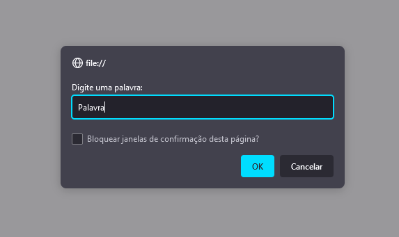
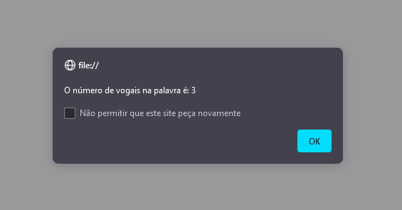

# Exercício 1

## Descrição da Sprint

1 - Criar uma função que retorne a quantidade de vogais da palavra passada.

- a) Dar um exemplo de uso com uma palavra recebida via parâmetro da função.
- b) Dar um exemplo de uso com uma palavra recebida via input no formulário.

## Linguagem utilizada

- Typescript

## Demonstrações

Demonstração do funcionamento da função por meio de formulário em HTML.

Saída do valor de entrada

O formulário está presente no arquivo "[formulario-1.html](../formulario-1.html)", e o código fonte em TypeScript pode ser encontrado [aqui](../numVogais.ts).
